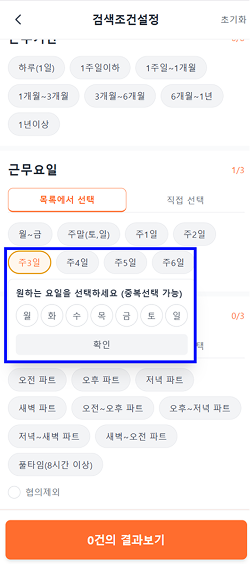
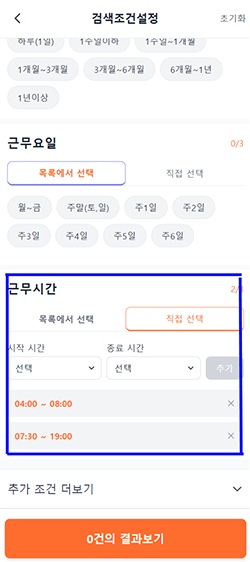

📄 최종 README.md
# 알바몬 검색조건설정 모바일UI 분석 및 솔루션 도출 페이지

모바일 웹 환경에서 **검색 조건 설정 UI**를 구현한 프로젝트입니다.  

---

## 🚀 실행 방법

### 1. 설치
```bash
npm install

2. 개발 서버 실행
npm run dev

🛠️ 기술 스택

React 18 (함수형 컴포넌트, 훅 기반)

TypeScript

Vite (개발 환경)

TailwindCSS (UI 스타일링)


📂 폴더 구조
project-root/
  src/              # 실제 코드 (React, TypeScript)
    components/
    pages/
  docs/             # 문서/스크린샷/설명 자료
    images/
      workdays1.png
      workdays2.png
      workhours.png
      accordion.png
  .cursor/
    rules
  README.md
  package.json
  vite.config.ts


✨ 주요 기능

근무기간, 요일, 시간, 고용형태 등 검색 조건 필터링 UI

하단 고정 CTA(“지원하기”) 버튼 → 필터 상태를 JSON 스키마로 직렬화

요일 선택 시 직접 선택 / 목록 선택 두 가지 모드 제공

근무시간 선택 시 리스트 / 직접 입력(시간대 범위) 모드 제공

접근성 고려 (aria-*, 키보드 조작 가능)

👩‍💻 내가 구현한 주요 기능 (Usage Example)
1. 근무 요일 선택

기능: 주 2일, 주 3일 등을 선택할 경우, 선호하는 요일을 추가로 선택할 수 있습니다.

사용 방법:

근무 요일 필터에서 주 2일, 주 3일 등 원하는 항목을 클릭합니다.

팝업이 열리면, 선호하는 요일(예: 월, 수, 금)을 직접 선택할 수 있습니다.

선택된 요일은 조건에 반영되어 하단 CTA(지원하기) 버튼으로 전달됩니다.

<div align="center">
  
  
</div>

2. 근무 시간대 다중 선택

기능: 원하는 시간대를 여러 개 등록할 수 있습니다.

사용 방법:

근무 시간 필터에서 직접 선택 탭으로 전환합니다.

시작/종료 시간을 지정한 뒤 추가하기 버튼을 클릭합니다.

여러 개의 시간대를 연속으로 등록할 수 있으며, 필요 시 삭제도 가능합니다.



3. 추가 조건 (아코디언)

기능: 성별, 연령 등 부가 조건은 기본 화면에서 보이지 않고, 아코디언 영역에 배치됩니다.

사용 방법:

추가 조건 더보기 버튼을 클릭합니다.

성별, 연령 등 부가적인 조건을 선택하거나 입력할 수 있습니다.

스크롤 부담을 줄이고, 필요한 경우에만 조건을 펼쳐서 볼 수 있습니다.


📌 커밋 규칙

Conventional Commits 규칙을 따릅니다.

feat: 새로운 기능

fix: 버그 수정

refactor: 리팩토링

style: 스타일/디자인 변경 (로직 없음)

docs: 문서 수정

chore: 빌드/환경설정

test: 테스트 코드
