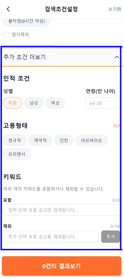

# 알바몬 검색조건설정 모바일 페이지 분석 및 솔루션 도출 UI

## 소개
모바일 웹 환경에서 **검색 조건 설정 UI**를 구현한 프로젝트입니다. 

## 실행 방법
```bash
npm run dev


<br>

---

## 👩‍💻구현한 주요 기능
1. **근무 요일 선택 개선**  
   - 주 2일, 주 3일 등 선택 시 → 사용자가 **선호하는 요일**을 추가로 선택할 수 있도록 구현  

2. **근무 시간대 다중 선택 기능**  
   - 원하는 시간대를 **여러 개 등록**할 수 있도록 UI/상태 관리 로직 구현  

3. **스크롤 최적화 (아코디언 적용)**  
   - 스크롤이 너무 길어지는 문제를 줄이기 위해  
   - 성별, 연령 등 부가 조건은 **“추가 정보” 아코디언** 안에 배치 → 사용자 경험 개선


<br>

## 기술 스택
**Frontend**: React.js, Vercel
<br>

## 프로젝트 구조 (Frontend)
```
src/
├── components/     Header, Footer, FilterComponents
├── pages/          
│   ├── searchUI

```

# 사용 예시 (Usage Example)

## 1. 근무 요일 선택
- **기능**: `주 2일`, `주 3일` 등을 선택할 경우, **선호하는 요일**을 추가로 선택할 수 있습니다.
- **사용 방법**:
  1. 근무 요일 필터에서 `주 2일`, `주 3일` 등 원하는 항목을 클릭합니다.
  2. 팝업이 열리면, 선호하는 요일(예: 월, 수, 금)을 직접 선택할 수 있습니다.
  3. 선택된 요일은 조건에 반영되어 하단 CTA(지원하기) 버튼으로 전달됩니다.

<div align="center">
  
  
</div>

---

## 2. 근무 시간대 다중 선택
- **기능**: 원하는 시간대를 **여러 개** 등록할 수 있습니다.
- **사용 방법**:
  1. 근무 시간 필터에서 `직접 선택` 탭으로 전환합니다.
  2. 시작/종료 시간을 지정한 뒤 **추가하기 버튼**을 클릭합니다.
  3. 여러 개의 시간대를 연속으로 등록할 수 있으며, 필요 시 삭제도 가능합니다.


---

## 3. 추가 조건 (아코디언)
- **기능**: 성별, 연령 등 부가 조건은 기본 화면에서 보이지 않고, **아코디언 영역**에 배치됩니다.
- **사용 방법**:
  1. `추가 조건 더보기` 버튼을 클릭합니다.
  2. 성별, 연령 등 부가적인 조건을 선택하거나 입력할 수 있습니다.
  3. 스크롤 부담을 줄이고, 필요한 경우에만 조건을 펼쳐서 볼 수 있습니다.




